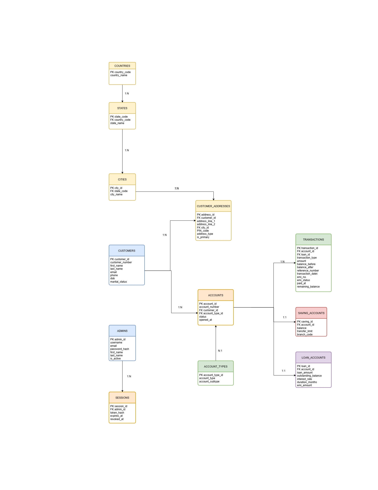

# ZENbank – Banking Management System

ZENbank is a full-stack banking management application designed to manage customers, bank accounts, transactions, loans, EMIs, and overall banking activity through a web-based interface.

The application uses React for the frontend, Node.js and Express for the backend, and MySQL for data management.

## Features

- Admin authentication and protected access
- Customer creation, search, and management
- Customer address management
- Country, state, city, and postal code handling
- Savings account management
- Loan account management
- Deposit and withdrawal processing
- Transaction history and filtering
- Loan EMI scheduling and payment tracking
- Dashboard with customer, account, loan, and transaction statistics
- PDF report generation

## Technology Stack

| Layer | Technologies |
|---|---|
| Frontend | React, Vite, React Router, Tailwind CSS, Lucide React, Framer Motion |
| Backend | Node.js, Express.js, JWT, bcrypt, mysql2, PDFKit |
| Database | MySQL |
| Configuration & Middleware | dotenv, CORS, cookie-parser |

## Application Architecture

The application follows a layered architecture where the React frontend communicates with the Express backend through REST APIs. The backend handles authentication, request processing, business logic, and database operations.

**Architecture Flow:**  
React + Vite → Express REST APIs → Authentication & Middleware → Controllers → Services → MySQL Database

Routes define the API endpoints, middleware handles authentication and common request processing, controllers manage HTTP requests and responses, and services contain the core business logic and database operations.

## Main Modules

### Authentication

Admin authentication is implemented using JWT. Passwords are securely hashed using bcrypt, and protected API routes are handled through authentication middleware.

### Customer Management

The customer module manages customer information and addresses. It also provides location-based selection for country, state, city, and postal code information.

### Account Management

The account module handles savings and loan accounts, account details, balances, and account-related operations.

### Transaction Management

The transaction module handles deposits, withdrawals, and transaction history. Financial operations update the relevant account balance and record the corresponding transaction.

### Loan & EMI Management

The loan module manages loan accounts, EMI schedules, EMI payments, and payment status, including paid and pending EMIs.

### Dashboard

The dashboard provides an overview of customers, accounts, loans, transactions, and overall banking activity using aggregated database information.

### Reports

The application supports PDF report generation for banking-related information using PDFKit.

## API Modules

| Module | Endpoint | Purpose |
|---|---|---|
| Authentication | `/api/auth` | Login and authentication |
| Customers | `/api/customers` | Customer management |
| Locations | `/api/locations` | Country, state, and city information |
| Addresses | `/api/addresses` | Customer address management |
| Accounts | `/api/accounts` | Savings and loan account operations |
| Transactions | `/api/transactions` | Deposits, withdrawals, and transaction history |
| Dashboard | `/api/dashboard` | Banking statistics and summaries |

## Database

MySQL is used as the relational database for the application.

The main database entities include:

- Administrators
- Customers
- Customer addresses
- Countries
- States
- Cities
- Account types
- Accounts
- Savings accounts
- Loan accounts
- Transactions
- Loan EMIs

### Database Diagram



## Backend Structure

The backend follows a modular structure with separate layers for API routes, middleware, controllers, and services.

```text
backend/
├── config/
├── database/
└── src/
    ├── controllers/
    ├── middleware/
    ├── routes/
    ├── services/
    └── app.js
```

This structure keeps routing, authentication, request handling, business logic, and database operations separated and easier to maintain.

## Frontend Structure

The frontend is organized as a React application with reusable components, pages, routing, and service modules for communication with the backend.

```text
frontend/
└── src/
    ├── components/
    ├── pages/
    ├── services/
    └── App.jsx
```

The frontend uses configurable API endpoints so that the same application structure can be used across different environments.
